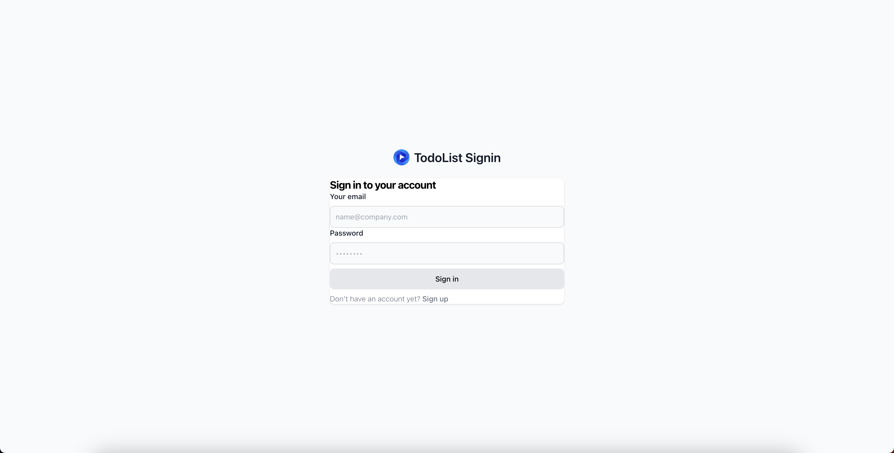
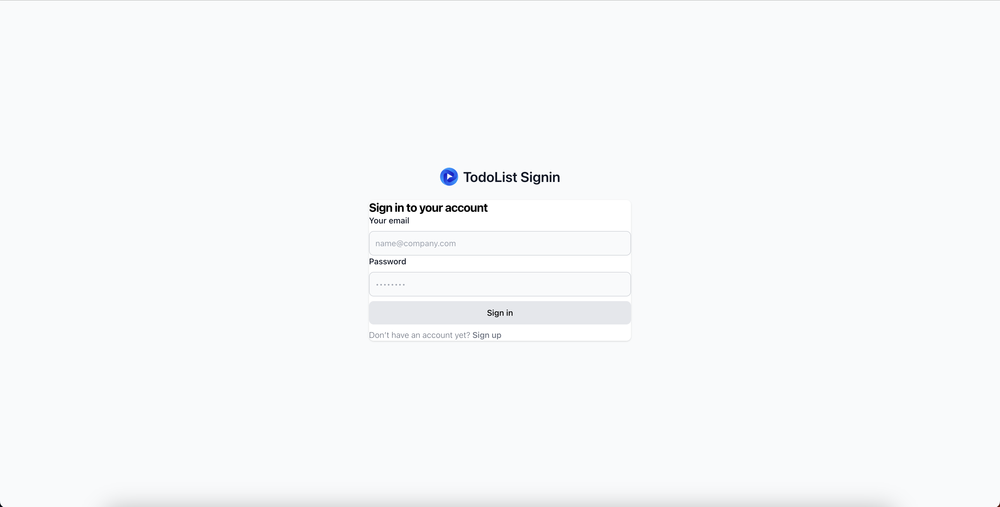
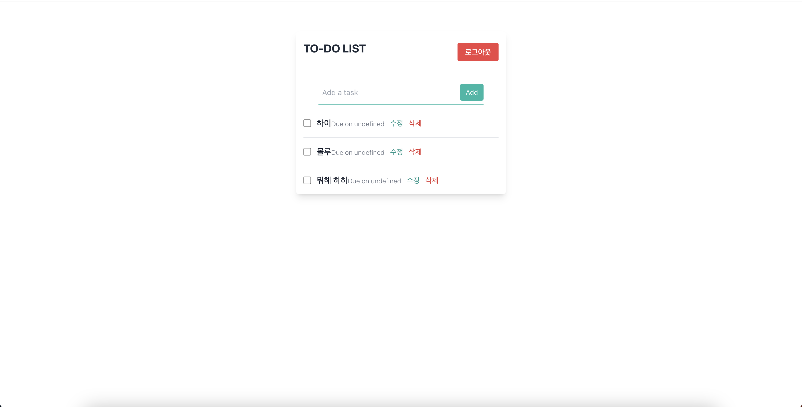

# 원티드 프리온보딩 프론트엔드 사전 과제

### 지원자의 성명
- 최정윤

### 프로젝트 사용 스킬
- react
- typescript
- tailwind

### 프로젝트의 실행 방법
1. git clone 받아주세요.
2. npm install & npm start 하시면 바로 실행됩니다.
3. 첫화면은 로그인 화면입니다.
4. signup 글씨를 누르시면 회원가입 창으로 이동합니다.
5. 로그인하시면 todo 창으로 이동합니다.
6. 로그아웃하시면 signin 창으로 이동합니다.

### 실행 화면
#### /signin

#### /signup

#### /todo

### 데모 영상

